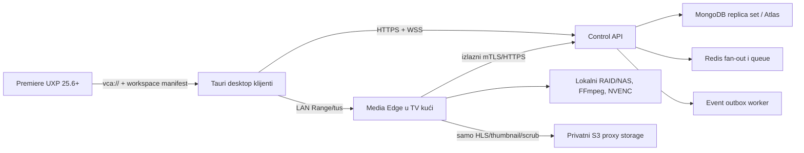

# Aplikacija v2 - arhitektura Windows sistema za TV produkciju

## Cilj i status

Aplikacija v2 pretvara postojeći browser klijent u instaliranu Windows 10/11 x64 aplikaciju. React/MUI ostaje UI renderer, Tauri 2 upravlja Windows integracijom, a backend ostaje mrežni servis. Branch `codex/aplikacija-v2` sadrži pilot temelj; produkcijski cutover, potpisivanje instalera i gašenje web UI-ja ostaju kontrolisani rollout koraci.

## Komponente

- `frontend/`: Vite, React, TypeScript postepeno, MUI, TanStack Query; rute su lazy-loaded.
- `apps/desktop/`: Tauri tray, autostart, single instance, deep link, Stronghold/Credential Manager, updater, SQLite i native transferi.
- `backend/`: kompatibilni `/api` i novi `/api/v2` ugovori.
- `apps/media-edge/`: outbound registracija/heartbeat, tus upload, Range download i media task polling.
- `apps/premiere-uxp/`: UXP manifest v5, media import, sequence i Storyboard markeri.
- `packages/contracts`, `domain`, `ui`: zajednički Zod ugovori, domenska pravila i role layout konstante.

## Sigurnost

- Access token je kratkotrajan i samo u memoriji renderera.
- Rotirajući refresh token je hashovan u MongoDB-u i na Windowsu se čuva kroz Credential Manager/Stronghold sloj.
- Device registracija omogućava heartbeat i remote revoke svih sesija uređaja.
- Edge prima taskove preko izlazne veze i koristi odvojene registration/transfer tajne.
- Download i media URL-ovi su vremenski ograničeni ticketi; putanje se provjeravaju unutar storage roota.
- MSI/NSIS i updater artefakti moraju biti potpisani prije stable kanala. Privatni ključ ne pripada repozitoriju.

## Performansni budžeti

- Cold start: do 3 s na pilot hardveru.
- Idle memorija: do 250 MB.
- Realtime notifikacija: do 2 s p95.
- Liste: server pagination i virtualizacija kada broj redova opravda.
- Video: HLS 720p/480p, MP4 Range fallback; nema kompletnog Blob preuzimanja.
- Transfer: `.part`, HTTP Range, SHA-256 kada je dostupan i SQLite recovery.

## Cutover pravilo

`DESKTOP_ONLY_MODE=false` ostaje dok pilot korisnici svih rola ne potpišu parity matricu. Nakon toga API se deploya sa `DESKTOP_ONLY_MODE=true`; `/api` i `/api/v2` ostaju dostupni, dok `/` vraća 410. Prethodni desktop release i stari API ugovori ostaju podržani tokom jednog rollback prozora.

## Reference

- [Tauri arhitektura](https://v2.tauri.app/concept/architecture/)
- [Tauri Windows prerequisites i WebView2](https://v2.tauri.app/start/prerequisites/)
- [Tauri testiranje](https://v2.tauri.app/develop/tests/)
- [MongoDB transakcije](https://www.mongodb.com/docs/v8.2/core/transactions/)
- [Redis Pub/Sub semantika](https://redis.io/docs/latest/develop/pubsub/)

