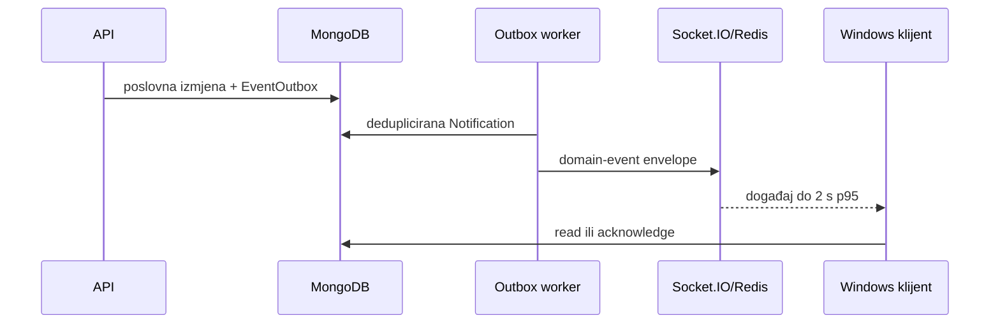

# Desktop notifikacije i realtime događaji

## Mehanizam

Poslovna promjena prvo upisuje `EventOutbox`. Worker iz događaja pravi deduplicirane `Notification` zapise, pa tek nakon trajnog upisa šalje Socket.IO događaj preko Redis adaptera. Redis nije izvor istine: korisnik koji je offline dobija backlog iz MongoDB-a pri reconnectu.

Envelope je `{ id, type, severity, entity, version, occurredAt, payload }`. Severity vrijednosti su `info`, `action_required` i `critical`.

## Critical pravila

- Promjena rundown-a nakon preuzimanja air paketa.
- Zamjena/brisanje klipa neposredno pred emitovanje.
- Nedostupan ili oštećen rundown materijal.
- Hitna correction prijava za aktivnu emisiju.

Desktop ponavlja neacknowledged critical upozorenje nakon 90 sekundi. Nakon 180 sekundi worker primjenjuje `EscalationPolicy`; Admin podešava politiku u modulu Desktop i Edge. `read` nije isto što i `acknowledged`: critical događaj se zatvara samo eksplicitnom potvrdom.

## Role routing

- Reporter: komentar montažera, zahtjev za dopunu, rok i status finala.
- Editor: dodijeljen job, novi materijal, Storyboard i correction job.
- Producer: QC/final odobrenje, correction queue i rundown verzija.
- Realizator: promjena emisije i air paketa; kritični događaji traže potvrdu.
- Archivist: review/correction materijal.
- Admin: kvar servisa, uređaja, edge čvora, outboxa ili transfera.

## Windows ponašanje

Tauri se pokreće pri prijavi, ostaje u trayu i klik na `vca://job/<id>`, `vca://video/<id>` ili Storyboard otvara tačan ekran. Zatvaranje prozora samo ga skriva; `Quit` upozorava na aktivne transfere. Dozvola za Windows obavijesti i zadnji heartbeat vidljivi su Adminu.

## Reference

- [Tauri notification plugin](https://v2.tauri.app/reference/javascript/notification/)
- [Windows app notifications](https://learn.microsoft.com/en-us/windows/apps/develop/notifications/app-notifications/)
- [Redis Pub/Sub delivery semantics](https://redis.io/docs/latest/develop/pubsub/)
- [Transactional outbox pattern](https://microservices.io/patterns/data/transactional-outbox.html)

